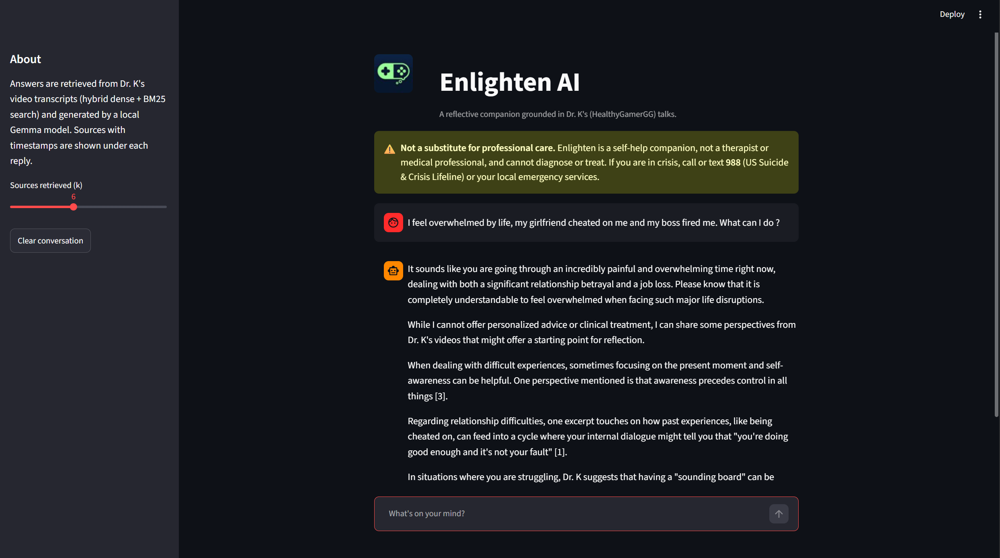
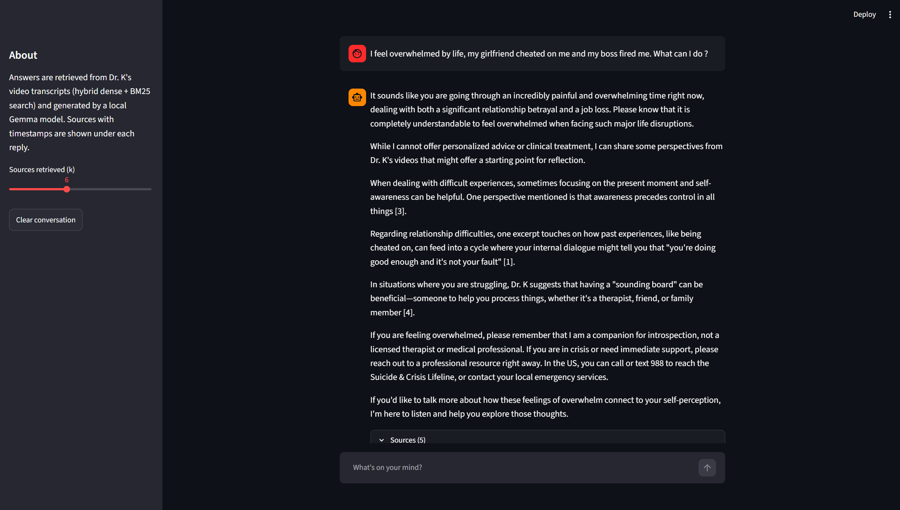
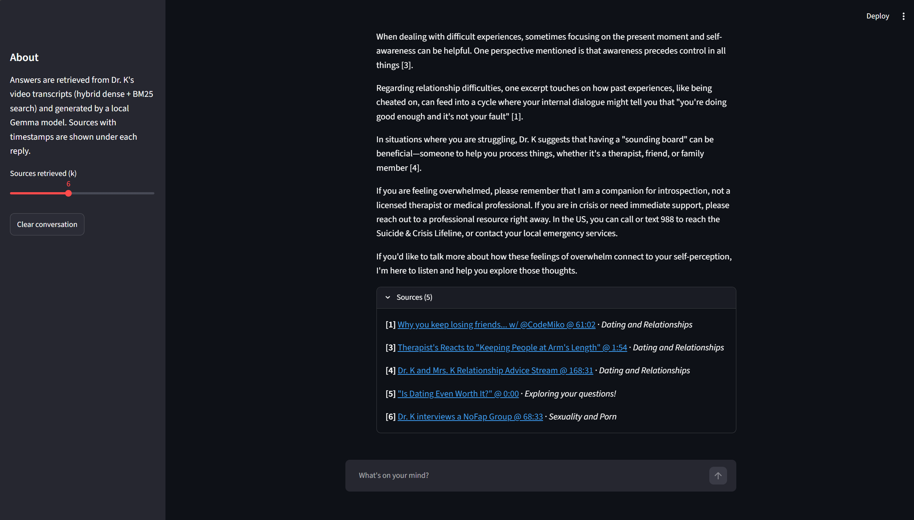

# Enlighten AI · DrK_Chat

A retrieval-augmented (RAG) mental-health/self-help chatbot grounded in transcripts of
Dr. K's (HealthyGamerGG) YouTube videos. It is a reflective companion — **not** a
substitute for a licensed therapist or medical care.

## Screenshots

The Streamlit chat UI: a persistent safety disclaimer, answers grounded in Dr. K's
videos, and expandable citations that deep-link to the exact moment in each source.

| Reflective, grounded answer | Inline citations + safety reminder | Timestamped sources |
|:---:|:---:|:---:|
|  |  |  |

## Pipeline at a glance

```
YouTube playlists ──(yt-dlp)──▶ metadata + audio
                  ──(captions / WhisperX)──▶ timestamped transcripts
        │
        ▼
  data/DrK_videos.csv  +  data/segments/<id>.json   (knowledge base)
        │
        ▼
  chunk ─▶ embed (bge-small) ─▶ Chroma (data/chroma)        + BM25 (derived)
        │
        ▼
  hybrid retrieval (dense + BM25, RRF) ─▶ grounded prompt ─▶ vLLM Gemma ─▶ cited answer
        │
        ▼
            Streamlit chat UI (DrK_Chat/app.py)
```

## Setup

Everything runs in the `enlighten` conda env (Python 3.12, `uv`):

```bash
conda activate enlighten
uv pip install yt-dlp youtube-transcript-api openai chromadb sentence-transformers \
               rank-bm25 streamlit pandas numpy tqdm python-dotenv \
               matplotlib seaborn scikit-learn wordcloud networkx vaderSentiment   # analysis/EDA
# CUDA torch first (so WhisperX doesn't pull a CPU build), then WhisperX:
uv pip install torch torchaudio --index-url https://download.pytorch.org/whl/cu124
uv pip install whisperx
```

Endpoints/paths are configured in `.env` (vLLM URL/key/model, embedding model, WhisperX).
See `config.py` for all knobs.

## Usage

```bash
# 1. Build/refresh the transcript dataset (captions first, WhisperX fallback)
python -m Scrapper.build_dataset                 # full refresh + new videos
python -m Scrapper.build_dataset --only-new      # fast incremental
python -m Scrapper.build_dataset --playlist "Anxiety" --limit 3   # smoke test

# 2. Ingest transcripts into the Chroma vector store
python -m DrK_Chat.ingest --rebuild

# 3. Exploratory analysis + report
python -m data_analysis.eda

# 4. Chat
streamlit run DrK_Chat/app.py
```

## Dataset schema (`data/DrK_videos.csv`)

`playlist_tag, playlist_url, video_url, channel_id, channel_url, video_title,
video_length, video_publish_date, video_rating, video_views, video_author,
video_keywords, video_description, video_transcript`

One row per video (videos in multiple playlists are de-duplicated; full membership and
timestamped segments live in `data/segments/<video_id>.json`).

## Roadmap

- [x] Identify data source (Dr. K / HealthyGamerGG videos)
- [x] Transcribe the videos (now: YouTube captions first, WhisperX fallback — replaces pytube)
- [x] Save the data into a CSV with metadata (+ timestamped segments for citations)
- [x] Conduct analysis on the dataset (`data_analysis/eda.py`)
- [x] Build a report on the dataset (`data_analysis/report.md`)
- [x] Design a RAG-based chatbot (minimal custom: openai client → vLLM Gemma)
- [x] Implement the knowledge-base store + open-source embeddings (ChromaDB + bge-small) — **hybrid dense+BM25 retrieval**
- [x] Preliminary web deployment (Streamlit chat app)
- [ ] Gather opinions to improve the experience

> [!Warning]
> This application does not aim to replace professional licensed therapists; it provides
> support for self-reflection. If you are in crisis, call or text **988** (US) or contact
> your local emergency services.
