# Dr. K Transcript Dataset — EDA Report

_Generated by `data_analysis/eda.py`. Knowledge base behind the DrK_Chat RAG bot._

> **Reading this report.** Each section states its **Method** (how the numbers were computed, from which source, with what parameters) and an **Interpretation** (what it means and the caveats). Conventions used throughout: *medians* are preferred over means because most quantities (views, length) are right-skewed; transcript text is *contraction-cleaned* before term counting (so "it's"/"don't" don't masquerade as content words); "embedding" = the per-video mean of its `BAAI/bge-small-en-v1.5` chunk vectors, L2-normalised, pulled live from the Chroma index.

## 1. Corpus at a glance

| Metric | Value |
|---|---|
| Videos (unique) | 199 |
| Videos with transcripts | 198 |
| Total content | 115.3 hours |
| Total words | 1,203,368 |
| Unique vocabulary (3+ chars) | 15,859 |
| RAG chunks indexed | 4,307 across 198 videos |
| Date range | 2019-10-25 → 2025-03-04 |
| Median video length | 22.6 min |
| Median transcript | 4,328 words |
| Median speaking rate | 191 words/min |
| Total views | 139,008,782 |
| Median views | 439,295 |
| Videos in >1 playlist | 14 |

**Method.** Aggregated over the canonical CSV (one row per video). `words` = whitespace-delimited tokens; `vocabulary` = distinct lower-cased alphabetic tokens of 3+ chars; chunk counts read live from the Chroma collection's metadata.
**Interpretation.** A focused but substantial corpus — **115 hours / 1,203,368 words** of one expert's framings on a single domain. That homogeneity is ideal for RAG: retrieval rarely has to disambiguate between unrelated authors or topics.

## 2. Content volume
### Video length & transcript size

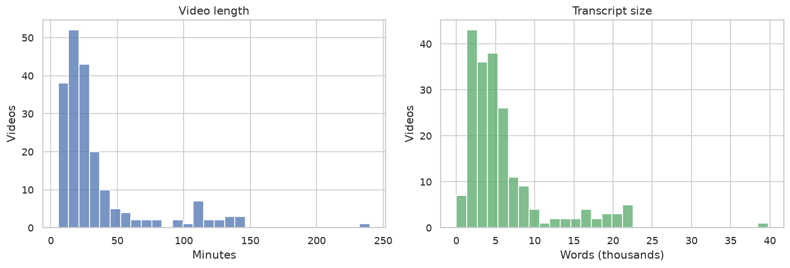

**Method.** Histograms over all videos: length = `video_length`(sec)/60; transcript size = word count of `video_transcript`.
**Interpretation.** Right-skewed: a typical video is **~23 min**, but a long tail of interviews/lectures runs much longer (**14%** exceed an hour, peaking at *Dr. K and Mrs. K Relationship Advice Stream* — 240 min). Those long videos produce many more chunks (see §9), so they dominate retrieval volume.

## 3. Speaking rate
### Words per minute

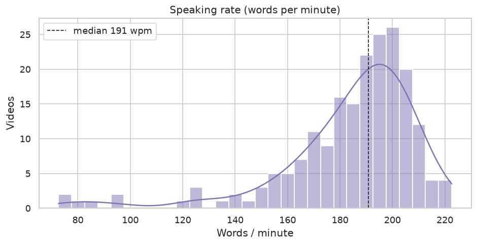

**Method.** `wpm` = words ÷ minutes per video; the histogram drops values ≤0 or ≥400 (implausible, usually from bad duration/transcript pairs).
**Interpretation.** Median **191 wpm** is right in the band for natural conversational English (~150–200). The slowest, *How to Overcome Shame and Feeling like a Failure* (73 wpm) — very low rates flag either genuinely sparse speech (meditations) or a truncated transcript (cross-check §19); the fastest, *The Addiction You Have (That You Don't Know About)* (223 wpm), is rapid-fire delivery. Slow/short videos yield few chunks, so they can under-surface in retrieval.

## 4. Engagement
### Views

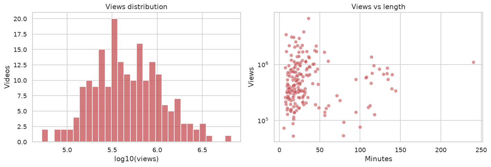

**Method.** Views from `video_views`. Left: histogram of log10(views) (raw views span orders of magnitude). Right: views vs length, log-y. Length↔views association measured with **Spearman ρ** (rank correlation, robust to the skew): **ρ = +0.16**.
**Interpretation.** ρ near zero means **length barely predicts views** — long interviews and short reactions both can go big; topic/title matters far more than runtime (see §12). The log-normal view distribution is the usual YouTube pattern (a few breakouts, a wide base).

**Top 10 most-viewed videos**

| Views | Length | Title |
|---:|---:|---|
| 6,631,883 | 36m | Why Gifted Kids Are Actually Special Needs |
| 3,831,643 | 30m | Dr. K Explains: Borderline Personality Disorder |
| 3,399,923 | 8m | Psychiatrist reacts to: "I have too much self-awareness" |
| 3,097,266 | 15m | How Years of Porn Consumption Affects Brain's Ability to Form Relationships |
| 3,049,244 | 18m | Why Therapy Sucks For Men |
| 2,912,446 | 24m | "I feel like I have no purpose." |
| 2,549,479 | 20m | How Quitting P*rn Can Be Dangerous |
| 2,198,037 | 29m | DOPAMINE - What It Is, and How To Beat It |
| 2,183,067 | 12m | The Unfair Advantage That Introverts Have |
| 2,157,898 | 22m | Why Don't You Want To Do Anything After Binging 4 Hours of YouTube Videos... |

## 5. Publishing timeline
### Cadence & cumulative hours

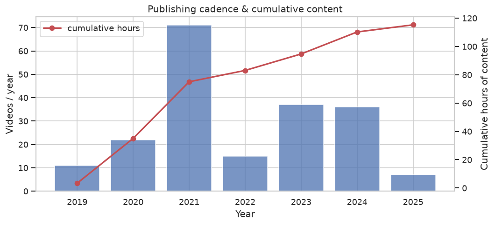

**Method.** Videos grouped by `video_publish_date` year; bars = count/year, line = cumulative hours (running sum of durations).
**Interpretation.** Output peaked in **2021** then settled into a steadier cadence. Because this is a *sample* of playlists (not the full channel), recent years are under-counted — so the dip at the right edge reflects sampling, not necessarily reduced output.

## 6. Playlists
### Videos & hours per playlist

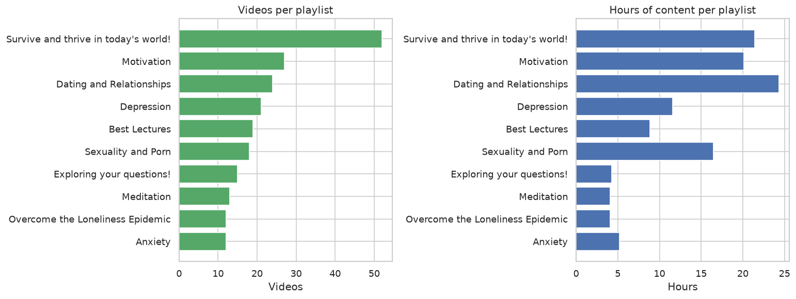

### Playlist co-occurrence

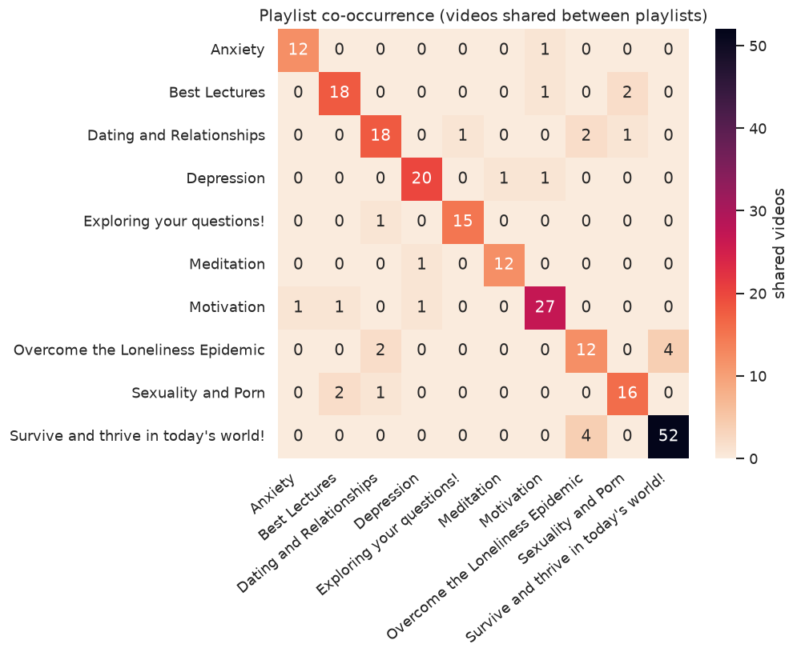

**Method.** Playlist membership taken from each video's segments-JSON `all_playlist_tags` (falls back to the CSV tag). Left/right bars: video count and summed hours per playlist. Heatmap: cell (i,j) = number of videos appearing in *both* playlists i and j (diagonal = playlist size).
**Interpretation.** *Survive and thrive in today's world!* is the largest theme (52 videos). Off-diagonal cells are small, so the playlists are **mostly disjoint** — Dr. K's own taxonomy already carves fairly clean topic boundaries, which §10–11 then test against the embeddings.

## 7. What each playlist is *distinctively* about (TF-IDF)

**Method.** Concatenate every transcript in a playlist into one document, then run **TF-IDF** (`TfidfVectorizer`, English+filler stop-words, contraction-cleaned) across the playlist-documents. High TF-IDF = frequent *in this playlist* yet rare across the others, i.e. genuinely distinguishing terms (not generic filler).
| Playlist | Distinctive terms |
|---|---|
| Survive and thrive in today's world! | willpower, empathic, empathy, inaction, flexibility, venting, dating, pleasure |
| Motivation | clients, resistance, client, conscientiousness, decision, kate, motivational, circadian |
| Dating and Relationships | dating, mom, hmm, pie, partner, yep, date, drama |
| Depression | ethan, shunya, mask, imposter, yep, genetics, esteem, loneliness |
| Best Lectures | bpd, gifted, alexithymia, adenosine, technology, text, sex, alexithymic |
| Sexuality and Porn | porn, sex, sexual, pornography, nofap, feminine, onlyfans, waifu |
| Exploring your questions! | pornography, caffeine, homework, dating, introvert, date, awkward, folder |
| Meditation | breath, shunya, breathe, metta, dharma, clench, zen, abdomen |
| Overcome the Loneliness Epidemic | vision, venting, charisma, cravings, pornography, arousal, solitude, loneliness |
| Anxiety | chuck, attack, danger, hail, breathing, entertaining, amygdala, expectation |

**Interpretation.** The terms are sharply on-topic (Meditation→*breath, metta, dharma*; Anxiety→*amygdala, breathing, attack*), confirming the transcripts carry strong, separable topical signal — the precondition for retrieval working well.

## 8. Language & themes
### Top words & bigrams

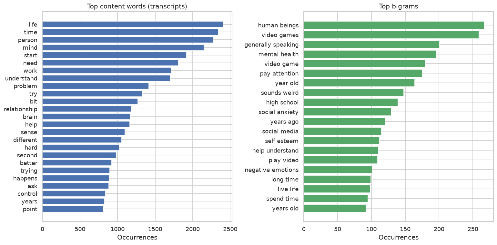

### Word cloud

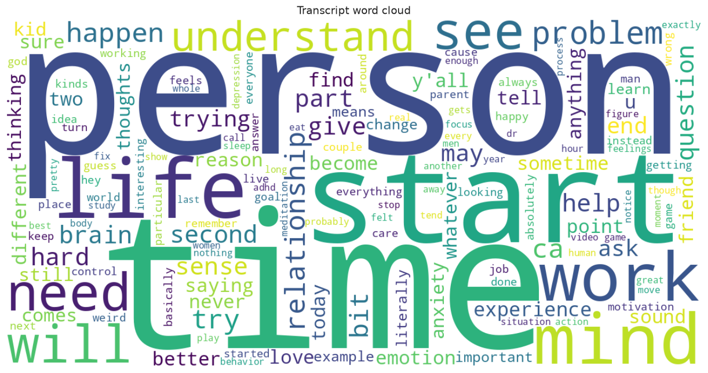

**Method.** Raw occurrence counts (`CountVectorizer`, min_df=3) over contraction-cleaned, stop-word-filtered transcripts — unigrams and bigrams. The word cloud sizes words by the same frequency.
**Interpretation.** Top terms (*life, mind, relationship, brain, control*) and bigrams (*mental health, video games, social anxiety, self esteem, negative emotions*) read like a table of contents for the channel — concrete confirmation of what the knowledge base covers.

## 9. RAG index
### Chunks per video

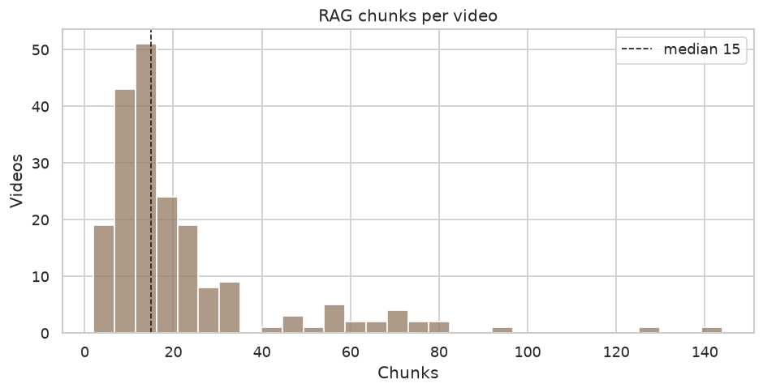

**Method.** Each transcript is split into overlapping ~450-token chunks (~60-token overlap) over its timestamped segments, then embedded and stored in Chroma; this counts chunks per `video_id` in the live index.
**Interpretation.** **4,307 chunks** (median 15/video, max 144). Chunk count tracks video length, so long interviews contribute the most retrievable passages — granular enough that retrieval returns a specific moment, not a whole hour-long video.

## 10. Semantic map of the corpus
### Video embedding map

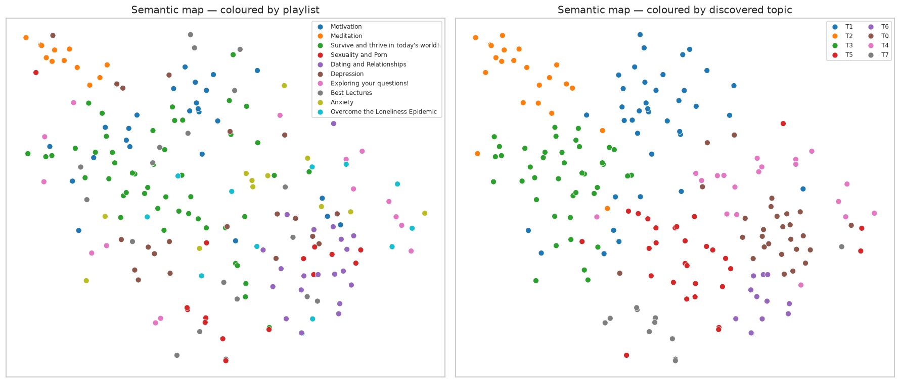

**Method.** Each video → mean of its bge chunk embeddings (384-dim), L2-normalised. Reduced to 2-D with **PCA→50 dims then t-SNE** (perplexity ≈ n/4). t-SNE preserves *local* neighbourhoods, so nearby points = semantically similar videos; absolute distances and axes are not meaningful.
**Interpretation.** Playlist colours form coherent regions rather than one blob — the embedding space already separates topics. Meditation sits apart (distinct vocabulary), while discussion topics border each other where themes overlap (e.g. relationships↔loneliness).

## 11. Data-driven topics (KMeans on embeddings)

**Method.** **KMeans (k=8)** clusters the video embeddings; each cluster is then labelled by the top **TF-IDF** terms of its members' transcripts (vs other clusters), with its most common playlist and an example title. This discovers topics *from the content*, independent of Dr. K's hand-made playlists.
| Topic | Videos | Dominant playlist | Distinctive terms | Example |
|---|---:|---|---|---|
| T3 | 40 | Survive and thrive in today's world! | dopamine, caffeine, nucleus, accumbens, adenosine, circadian | Why It's So Hard To Make Decisions |
| T1 | 38 | Motivation | clients, resistance, gifted, crisis, client, venting | What Sets Professional Esports Athletes Apart From Average Gamers |
| T5 | 29 | Survive and thrive in today's world! | bpd, empathic, gaslighting, attachment, esteem, narcissism | Are You More Than Your Sex Life? \| Overcoming Jealousy |
| T0 | 27 | Dating and Relationships | mom, yep, pie, feminine, ingrid, ethan | The Power of Monk Mode: Conquering Desire |
| T2 | 22 | Meditation | shunya, visualize, breathe, visualization, exhale, vibration | Meditation For Your Big Ego |
| T4 | 19 | Anxiety | mask, charisma, introvert, interactions, arousal, solitude | You Don’t Speak Unless You Are Spoken To |
| T6 | 12 | Dating and Relationships | attraction, grill, flirtation, clingy, flags, lust | How To Get A Girlfriend |
| T7 | 11 | Sexuality and Porn | pornography, porn, bdsm, nofap, relapse, birth | Dr. K interviews a NoFap Group |

**Interpretation.** The unsupervised clusters line up with recognisable themes (neuroscience-of-motivation: *dopamine/adenosine/circadian*; meditation: *breathe/exhale*; porn/NoFap; dating) and each maps to a dominant playlist — independent confirmation that the embeddings encode real topical structure, so hybrid retrieval is searching a well-organised space.

## 12. What drives views
### Title-word view lift

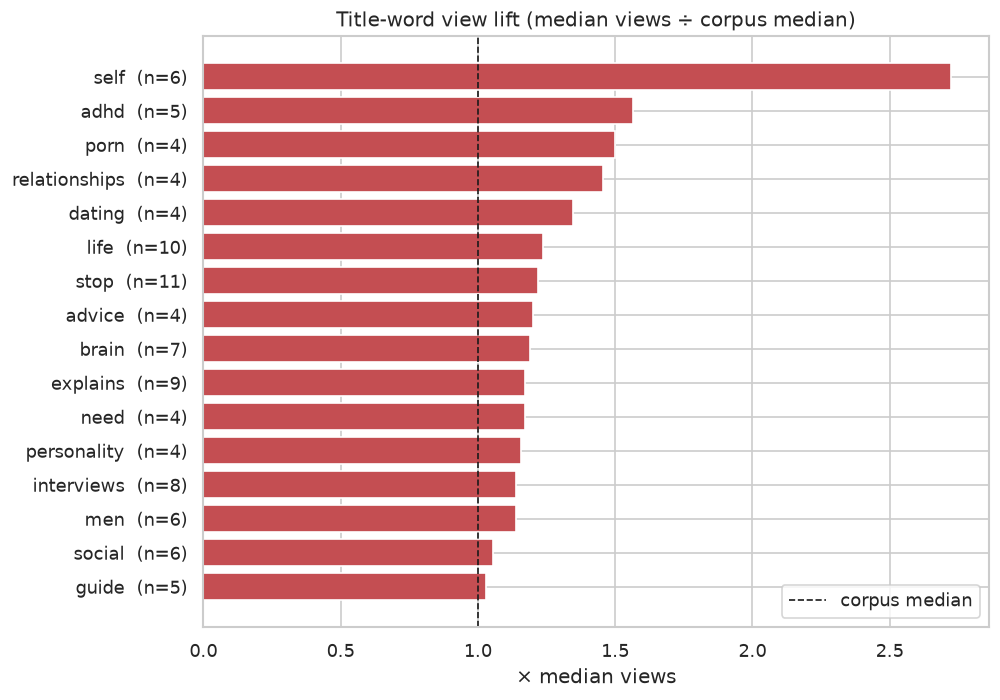

**Method.** Tokenise titles (contraction-cleaned, stop-words removed). For each word in ≥4 titles, **lift = median views of videos whose title contains it ÷ corpus median views**. Lift > 1 ⇒ that word's videos out-perform the typical video.
**Interpretation.** *self* tops the list at **~2.7×** the median, with *adhd / porn / relationships / dating* close behind — the audience gravitates to identity and relationship themes. **Caveats:** this is correlational, not causal (title word ≠ reason for views), and per-word counts are small (n shown on the chart), so read it as a signal, not proof.

## 13. Conversational style (introspection)
### Question density

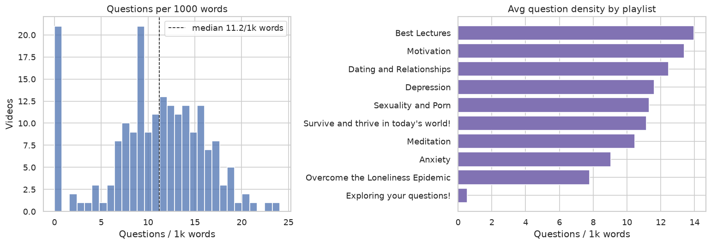

**Method.** Question density = count of `?` ÷ words × 1000, per video; left = distribution, right = per-playlist mean.
**Interpretation.** A median **11.2 questions / 1,000 words** quantifies Dr. K's Socratic, introspection-first style — exactly the behaviour the bot's persona emulates. **Caveat:** the spike at 0 is an artifact — some WhisperX/text-only transcripts lack `?` punctuation, so question density is *under*-counted for those (the median is robust to it, but the per-playlist bar is skewed for affected playlists).

## 14. How the focus shifted over time (TF-IDF per year)

**Method.** One concatenated transcript-document per publish year, then **TF-IDF** across years — surfacing each year's distinctive vocabulary relative to the others.
| Year | Distinctive terms |
|---|---|
| 2019 | breath, breathe, dharma, kevin, curl, clench, ankles |
| 2020 | yep, hmm, women, porn, stream, feminine, hearing |
| 2021 | game, mom, clients, parents, relationships, dopamine, terms |
| 2022 | bpd, relationships, alexithymia, esteem, technology, interaction, parents |
| 2023 | women, check, visualize, learning, stress, game, vision |
| 2024 | game, dopamine, addiction, willpower, empathic, relationships, pornography |
| 2025 | addiction, shadow, inaction, desperation, actions, stance, direction |

**Interpretation.** A visible thematic drift — early meditation/breathing → relationships & gaming → clinical frameworks (*BPD, alexithymia*) → recent *addiction/willpower/shadow*. Useful context for the bot: coverage of newer framings depends on the newer videos being present in the index.

## 15. Retrieval benchmark — does hybrid actually help?

### Dense vs BM25 vs hybrid

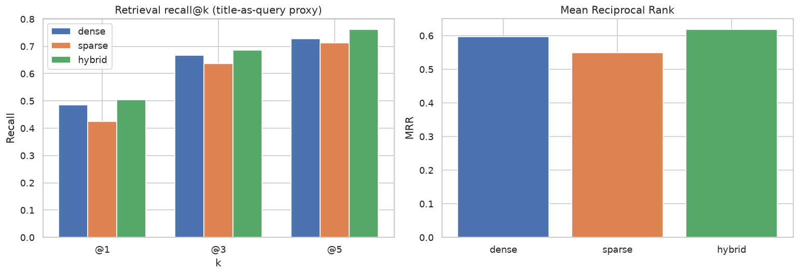

**Method.** A proxy retrieval test over the 198 indexed videos: each video's **title is used as a query**, and we record whether a chunk from that same video is returned. **Recall@k** = fraction of queries whose correct video is in the top-k; **MRR** (mean reciprocal rank) = average of 1/(rank of the first correct hit). The three retrievers — dense (bge vectors), sparse (BM25), and the hybrid RRF fusion — run the identical task, so differences are attributable to the method.
| Method | Recall@1 | Recall@3 | Recall@5 | MRR |
|---|---:|---:|---:|---:|
| dense | 0.485 | 0.667 | 0.727 | 0.597 |
| sparse | 0.424 | 0.636 | 0.712 | 0.549 |
| hybrid | 0.505 | 0.687 | 0.763 | 0.619 |

**Interpretation.** **`hybrid` wins on every metric**, beating dense-only by **+0.022 MRR** and BM25 by more — the empirical justification for the hybrid retriever: dense catches paraphrase/semantics, BM25 catches exact terms (names, jargon), and RRF keeps the best of both. **Caveat:** title-as-query is an easy proxy (title words often recur in the transcript), so absolute scores run high; the reliable signal is the *ordering* of methods, and this harness can now regression-test retrieval whenever the embedding model or chunking changes.

## 16. Concept co-occurrence network
### Concept graph

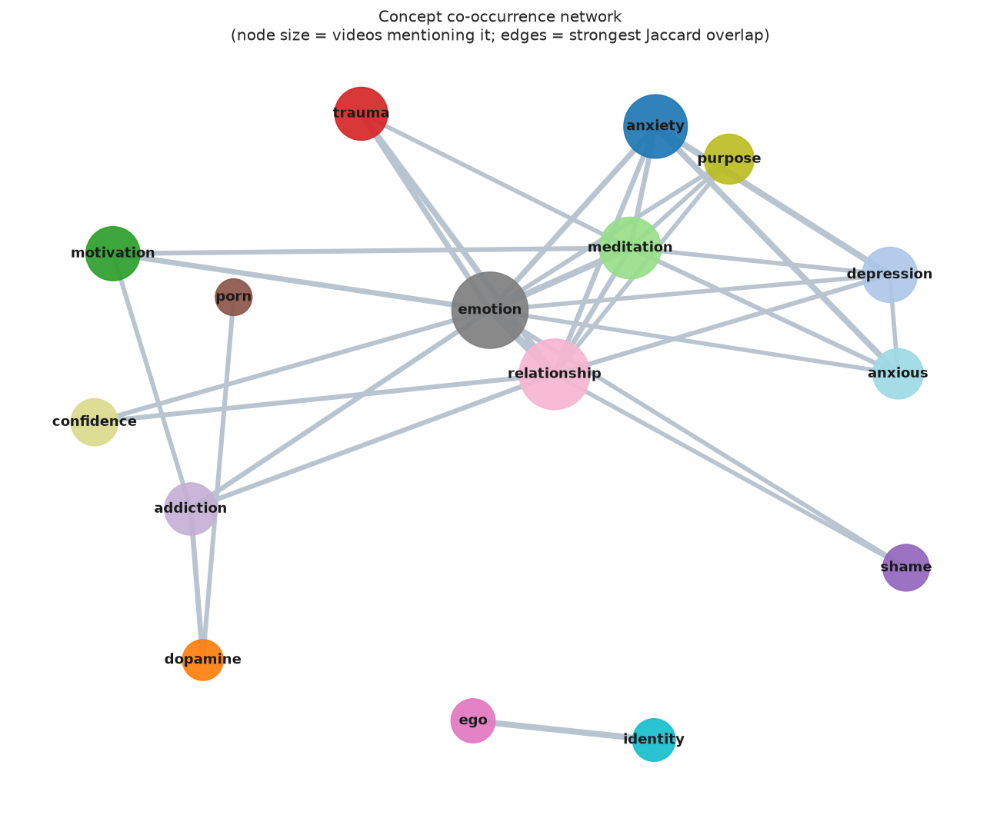

**Method.** For a fixed list of mental-health concepts, mark each as present in a video if its word-stem appears in the transcript. Edge weight between two concepts = **Jaccard overlap** of their video sets (|A∩B| / |A∪B|) — this normalises out sheer frequency so broad concepts don't connect to everything. Only the strongest ~32 edges are drawn; node size = number of videos mentioning the concept; layout = force-directed (spring).
**Interpretation.** *emotion* and *relationship* are the central hubs everything routes through; a tight **motivation–addiction–dopamine–confidence** cluster captures the behaviour-change thread, and an **anxiety–depression** cluster the clinical-affect thread, while *ego↔identity* stand apart. This is, in effect, a map of Dr. K's recurring mental-models.

## 17. Cross-video redundancy (most similar pairs)

**Method.** Cosine similarity between every pair of (L2-normalised) video embeddings = their dot product; the table lists the highest-scoring distinct pairs.
| Similarity | Video A | Video B |
|---:|---|---|
| 0.985 | Motivation and Goals \| Part 3: Resistance vs. Intent | Motivation and Goals \| Part 1: Intro to Motivation and Coaching |
| 0.984 | Dr. K interviews a NoFap Group | Helping Viewers with Porn Addiction |
| 0.979 | Not Wanting to Die, but Not Wanting to Live \| Dr. K Interviews | Talking with an Overwhelmed, Resilient Addict |
| 0.978 | Is Empathy Your Most Underrated Superpower? | The Dark Side of Empathy |
| 0.975 | A Bedtime Routine Isn't The Answer | Why Your Sleep Habits Aren't Healthy |
| 0.974 | Why you keep losing friends... w/ @CodeMiko | Dr. K Chats with @Amouranth about Burnout and Productivity |
| 0.974 | Motivation and Goals \| Part 4: Goals | Motivation and Goals \| Part 1: Intro to Motivation and Coaching |
| 0.974 | Why You Lack Motivation \| Viewer Interview | Healing from Festered Emotions ft. Ethan Nestor (CrankGameplays) |

**Interpretation.** The top pairs are genuine near-duplicates — multi-part series (*Motivation and Goals* Parts 1/3/4) and same-topic videos (NoFap/porn-addiction). For the bot this is a heads-up: a single query can pull several near-identical chunks from these, so de-duplicating retrieved sources (or capping chunks per video) would broaden the perspectives shown to the user.

## 18. Emotional arc — valence baseline (VADER)
### Sentiment across the video timeline

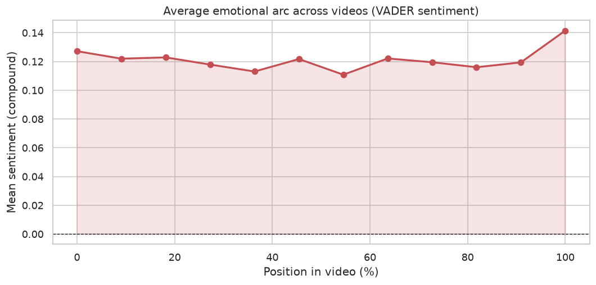

**Method.** Each segment scored with **VADER** compound sentiment (lexicon-based, −1…+1) — a fast valence baseline. Every video's timeline is normalised to 0–100%, split into 12 bins, and scores are averaged within each bin across all videos with ≥12 segments.
**Interpretation.** The corpus skews mildly **positive throughout**, dips in the middle (where the problem is examined) and rises to its **peak at the end** (Δ=+0.014 start→finish, more hopeful) — a problem→resolution shape. VADER only measures valence (one axis) and is tuned for social media; §19 replaces it with a model that resolves *which* emotions are present. Treat the *shape*, not the absolute values, as the finding.

## 19. Fine-grained emotion analysis (transformer)

### Corpus emotion profile & per-emotion arcs

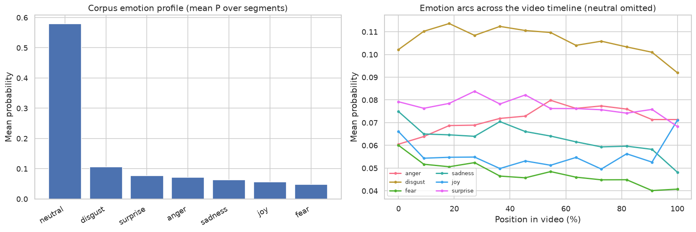

**Method.** Every transcript segment (≥4 words; 79,889 in total) is classified by **`j-hartmann/emotion-english-distilroberta-base`**, a RoBERTa model that outputs a probability over 7 emotions (anger, disgust, fear, joy, neutral, sadness, surprise) — far richer than VADER's single valence axis. Left: mean probability per emotion across the whole corpus. Right: each emotion averaged within 12 normalised timeline bins (neutral omitted for legibility).
**Interpretation.** Segments are mostly **neutral** (58% — expected for expository talk). Across the timeline the heavier emotions ebb — **sadness drops** most from start to finish — while **anger rises**, a shift away from dwelling on the problem toward activation that echoes the VADER valence arc in §18, now resolved into specific emotions. **Model caveat:** this classifier is known to over-assign **disgust** to frank or critical (non-sad) language, so disgust tops the felt-emotion profile here partly as an artifact — trust *relative* differences (across playlists and position) over the absolute ranking of any single emotion.

## 20. Emotional fingerprint by playlist & engagement

### Per-playlist emotion heatmap

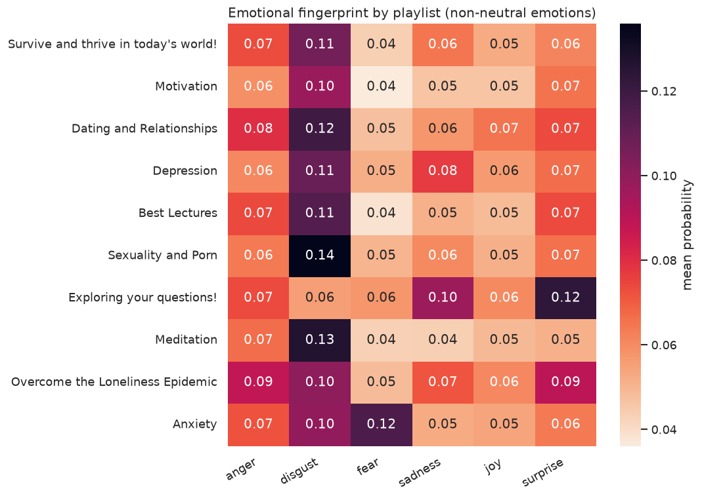

**Method.** The per-segment emotion probabilities are averaged to a video, then to a playlist; the heatmap shows each playlist's mean probability for the six non-neutral emotions. Per-video **valence** = P(joy) − P(anger+disgust+fear+sadness); its rank correlation with views is **Spearman ρ = +0.01**.
**Interpretation.** Playlists carry distinct affective signatures — **Anxiety** is highest in *fear*, **Exploring your questions!** in *sadness*, **Dating and Relationships** in *joy* — a sanity check that the classifier tracks real content, and useful for tone-matching the bot's responses by topic. Valence↔views ρ near zero means **emotional tone doesn't predict popularity**; audiences don't simply prefer cheerful or heavy videos. Extremes: most positive = *The Power of Monk Mode: Conquering Desire*; most negative = *Can Anger Actually be Healthy? (Healthy vs Unhealthy Anger)*; highest *fear* = *Two Solutions to Anxiety*.

## 21. Data quality

- **Transcript sources:** whisperx=166, captions=22, text-only (CSV fallback, no timestamps)≈10.
- WhisperX dominates because YouTube rate-limited the captions API from this host; WhisperX output carries word-level timestamps, which improves citation precision.
- **Truncation candidates (2)** (meditation/low-speech playlists excluded):
  - How to Overcome Shame and Feeling like a Failure — 500s, 3183 chars
  - Attachment Styles Deep Dive (Valentines Members Gift) — 8022s, 0 chars
- One row per video (multi-playlist videos de-duplicated; full membership in each segments JSON `all_playlist_tags`). `video_rating` is empty (YouTube removed it). Citation timestamps come from the segments JSON, not the CSV.
