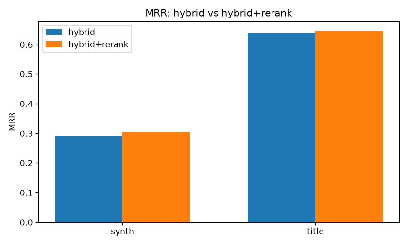

# Reranker Experiment — does a cross-encoder help?

_A/B on the **production** (cleaned) index: hybrid vs hybrid+rerank, reranker `BAAI/bge-reranker-base` over the top-50 hybrid candidates. Evaluated by `data_analysis/rerank_experiment.py`. Significance = paired bootstrap 95% CI on the per-query reciprocal-rank delta (rerank − hybrid)._

## Results
| Eval | Stage | R@1 | R@3 | R@5 | R@10 | MRR | ΔMRR | 95% CI | Verdict |
|---|---|--:|--:|--:|--:|--:|--:|--|--|
| synth (n=120) | hybrid | 0.175 | 0.333 | 0.433 | 0.550 | 0.292 | — | — | — |
| synth | +rerank | 0.192 | 0.342 | 0.425 | 0.550 | 0.306 | +0.014 | [-0.038, +0.067] | ➖ INCONCLUSIVE |
| title (n=198) | hybrid | 0.535 | 0.692 | 0.763 | 0.848 | 0.638 | — | — | — |
| title | +rerank | 0.540 | 0.727 | 0.768 | 0.838 | 0.646 | +0.008 | [-0.047, +0.063] | ➖ INCONCLUSIVE |

**Added latency:** ~164 ms/query median to rerank 50 candidates on `cuda:0`.

## Decision

- On realistic (synth) queries the reranker is **➖ INCONCLUSIVE** (ΔMRR +0.014, CI [-0.038, +0.067]). Weigh any gain against the added per-query latency above.
