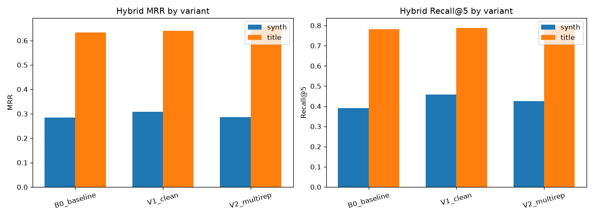

# Retrieval Experiment — do transcript transforms help?

_Test-driven A/B of transcript transforms, evaluated by `data_analysis/retrieval_experiment.py` on a fixed query benchmark. Lower-noise design: only the indexed text changes between variants; chunking, embedder (`BAAI/bge-small-en-v1.5`), retriever and queries are constant._

## Variants
- **B0 baseline** — raw transcript chunks (current production).
- **V1 clean** — deterministic per-segment cleaning (repetition/filler collapse).
- **V2 multirep** — chunks augmented with an LLM query-surrogate in dense+lexical representations (surrogate coverage 100%); original text stays the cited document.

## Method
Two fixed eval sets: **title** (video title as query) and **synth** (Gemma-generated user questions). Gold = the source video; we measure **video-level recall@k** and **reciprocal rank** over **hybrid** (dense+BM25+RRF) and **dense-only** retrieval. Significance = paired **bootstrap 95% CI** on the per-query reciprocal-rank delta vs B0 (positive ⇒ better than baseline).

Chunks indexed per variant: B0_baseline=3878, V1_clean=3857, V2_multirep=3878.

## Results — hybrid retrieval

| Variant | Eval | R@1 | R@3 | R@5 | R@10 | MRR | ΔMRR vs B0 | 95% CI | Verdict |
|---|---|--:|--:|--:|--:|--:|--:|--|--|
| B0_baseline | synth | 0.158 | 0.333 | 0.392 | 0.533 | 0.284 | — | — | — |
| V1_clean | synth | 0.183 | 0.350 | 0.458 | 0.583 | 0.308 | +0.024 | [+0.008, +0.042] | ✅ INCLUDE |
| V2_multirep | synth | 0.150 | 0.333 | 0.425 | 0.575 | 0.287 | +0.003 | [-0.033, +0.038] | ➖ INCONCLUSIVE |
| B0_baseline | title | 0.511 | 0.697 | 0.782 | 0.867 | 0.632 | — | — | — |
| V1_clean | title | 0.532 | 0.691 | 0.787 | 0.862 | 0.641 | +0.008 | [-0.012, +0.028] | ➖ INCONCLUSIVE |
| V2_multirep | title | 0.543 | 0.734 | 0.798 | 0.883 | 0.660 | +0.027 | [+0.002, +0.053] | ✅ INCLUDE |

## Results — dense retrieval

| Variant | Eval | R@1 | R@3 | R@5 | R@10 | MRR | ΔMRR vs B0 | 95% CI | Verdict |
|---|---|--:|--:|--:|--:|--:|--:|--|--|
| B0_baseline | synth | 0.167 | 0.267 | 0.358 | 0.500 | 0.262 | — | — | — |
| V1_clean | synth | 0.208 | 0.283 | 0.375 | 0.517 | 0.294 | +0.032 | [+0.007, +0.059] | ✅ INCLUDE |
| V2_multirep | synth | 0.183 | 0.308 | 0.392 | 0.500 | 0.282 | +0.019 | [-0.004, +0.043] | ➖ INCONCLUSIVE |
| B0_baseline | title | 0.484 | 0.676 | 0.739 | 0.846 | 0.603 | — | — | — |
| V1_clean | title | 0.484 | 0.686 | 0.761 | 0.814 | 0.601 | -0.002 | [-0.021, +0.017] | ➖ INCONCLUSIVE |
| V2_multirep | title | 0.484 | 0.697 | 0.761 | 0.872 | 0.615 | +0.012 | [-0.012, +0.036] | ➖ INCONCLUSIVE |

### Summary figure

## Decision (auto-generated from the numbers)

- **V1_clean** — hybrid: synth ✅ INCLUDE (CI [+0.008,+0.042]), title ➖ INCONCLUSIVE (CI [-0.012,+0.028]).
- **V2_multirep** — hybrid: synth ➖ INCONCLUSIVE (CI [-0.033,+0.038]), title ✅ INCLUDE (CI [+0.002,+0.053]).

_Decision rule: INCLUDE only if the bootstrap CI of ΔMRR excludes 0 on the realistic (synth) set and the title set agrees in direction; otherwise EXCLUDE / INCONCLUSIVE, weighed against cost (V2 needs an LLM call per chunk)._
